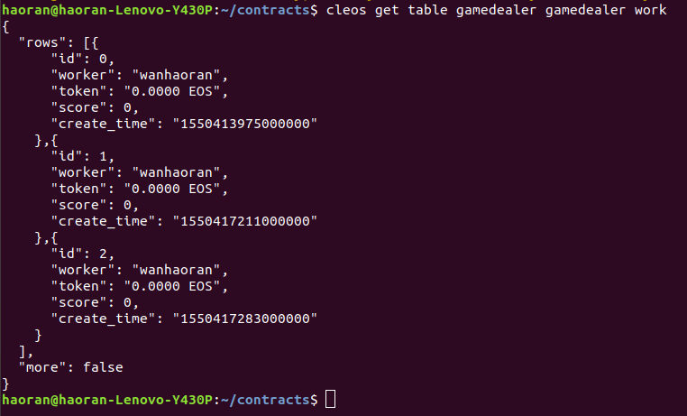

一 目标
=====

1.创建一个合约数据库表可以自定义存储内容，使用主键自增，增加数据观察RAM消耗，删除数据观察RAM消耗。<br>
2.创建合约 action==kpi<br>
实现功能：<br>
记录本次用户的KPI得分，并且发放相应TOKEN奖励到用户账户并记录下奖励TOKEN数量。<br>
分值和token获得数量比例为1比10，获得1分kpi得分就会获取10 EOStoken。<br>
即每次执行方法记录用户信息、用户KPI得分、用户获取token数量信息。<br>
并且使用RPC接口查询数据。<br>
主键自增。<br>
存储的结构体信息如下：<br>
```
struct [[eosio::table]] work{
   uint64_t id;
   name worker;
   asset token;
   uint64_t score;
   uint64_t creat_time= current_time();
   //主键
   uint64_t primary_key() const {  return id; }


   //序列化数据。
   EOSLIB_SERIALIZE( work, (id)(worker)(token)(score)(creat_time))
};
```  
思考题：怎么减少RAM资源消耗的使用。<br>

二 编写合约
=====
```
#include <eosiolib/eosio.hpp>
#include <eosiolib/print.hpp>
#include <eosiolib/asset.hpp>
#include <eosiolib/action.hpp>
#include <eosiolib/symbol.hpp>
#include <eosiolib/singleton.hpp>
#include <eosiolib/transaction.hpp>
#include <eosiolib/crypto.h>
#include <eosiolib/dispatcher.hpp>

using namespace eosio;

class [[eosio::contract]] homework3 : public contract {
	public:
		using contract::contract;
		
		//用来创建一个work表项
		[[eosio::action]]
		void add(name from){
			work_index works(_self,_self.value);

			works.emplace(_self, [&](auto& work){
				work.id = works.available_primary_key();
				work.worker = from;
				work.token = asset(0, symbol("EOS", 4));
				work.score = 0;
			});		
		}


		//用来删除work表中的一个表项
		[[eosio::action]]
		void del(uint64_t id){
			work_index works(_self,_self.value);

			auto item = works.find(id);
			works.erase(item);
		}

		//kpi action，用来通过id来发放EOS
		[[eosio::action]]
		void kpi(uint64_t id, uint64_t score){
			require_auth(_self);
			work_index works(_self,_self.value);
			
			auto item = works.find(id);

			works.modify(item,_self,[&](auto& work){
				work.score = score;
				work.token = asset(score*10*10000, symbol("EOS",4));
			});
			action(permission_level {_self,name("active")},
			name("eosio.token"), name("transfer"),
			std::make_tuple(_self,item->worker,asset(score*10*10000, symbol("EOS",4)),
				std::string("game send EOS")) ).send();
			
		}

		//@abi table work i64
		struct [[eosio::table]] work{
			uint64_t id;
			name worker;
			asset token;
			uint64_t score;
			uint64_t create_time = current_time();
			//主键
			uint64_t primary_key() const {return id;}
			
			//序列化数据
			EOSLIB_SERIALIZE(work,(id)(worker)(token)(score)(create_time))
		};
		typedef eosio::multi_index<"work"_n, work> work_index;		
};


#define EOSIO_DISPATCH_CUSTOM(TYPE, MEMBERS) \
extern "C" { \
   void apply( uint64_t receiver, uint64_t code, uint64_t action ) { \
   auto self = receiver; \
      if(( code == self&&action != name("transfer").value) ) { \
        switch( action ) { \
            EOSIO_DISPATCH_HELPER( TYPE, MEMBERS ) \
         } \
         /* does not allow destructor of this contract to run: eosio_exit(0); */ \
      } \
   } \
} \


EOSIO_DISPATCH(homework3,(add)(del)(kpi))
```  

三 编译合约
=====
```
eosio-cpp -o homework3.wasm homework3.cpp -abigen
```  
  

四 部署合约
=====
```
cleos set contracts gamedealer /home/haoran/contracts/eosio.contracts/hello/ -p gamedealer@active
```  
  

五 增加表项，查看用户的RAM消耗
=====
查看用户原始状态及table状态  
```
cleos get account gamedealer
cleos get table gamedealer gamedealer work
```  
  
连续创建了两个表项  
```
cleos push action gamedealer add '["wanhaoran"]' -p gamedealer@active
```  
  
命令行查询当前的记录  
```
cleos get table gamedealer gamedealer work
```  
  
通过postman查询表的状态  

查询当前的账户状态  
```
cleos get account gamedealer
```  
  
可以看到当前的memory多了0.3kb  

六 删除表项，查看用户的RAM消耗
=====
删除前  
  
```
cleos push action gamedealer del '["1"]' -p gamedealer@active
```  
再次查询table  
  
删除后账户状态  
  
可以看到memory减少了0.1kib  

七 执行kpi的action
=====
给id为2的账户一个kpi  
给之前的账户状态及table状态  
  
执行kpi action  
```
cleos push action gamedealer kpi '["2",1]' -p gamedealer@active
```  
  
计kpi之后的账户余额以及table状态，可以看到帐户余额由原来的空变成了10.0000 EOS同时table也更新了  
  
使用RPC接口查询  
  

八 思考如何减少RAM资源消耗的使用
=====
1.对表项结构更好的设计，减少存储所需要的空间  
2.业务上减少数据的存储  

九 碰到的问题及解决
=====
abi文件中没有table的内容。  
解决：尝试手动输入无果，需要在class后面加上[[eosio.contract]]才行  
  
P.S. hello文件夹是听课过程中学习的cotract文件，homework3是写作业所用的文件  
P.P.S. 作业流程和格式上参考了黎倚杭同学（https://github.com/baidang201/eosDappNotes/tree/master/lesson-three）的流程，但是内容是自己独立完成的  


